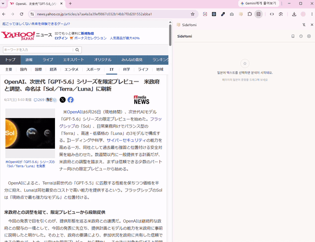

# SideYomi

> **side + 読み(요미)** - 페이지를 건드리지 않고, Chrome 사이드 패널에서 일본어 발음·단어 뜻·번역을 확인하는 확장 프로그램.

웹페이지의 일본어를 드래그하면 오른쪽 패널에서 형태소 단위로 분석해 후리가나(요미가나), 뜻, 번역을 제공합니다.
기존 후리가나 확장 프로그램들은 페이지 DOM을 직접 수정해 레이아웃이 깨지거나, 사용자가 원하지 않는 순간에도 동작하는 경우가 많았는데요.

SideYomi는 Chrome Side Panel API를 활용해 원본 페이지를 전혀 수정하지 않고, 필요한 순간에만 정보를 제공하는 것이 특징입니다.

---

## 데모



## 주요 기능

- **텍스트 선택 감지** - content script가 선택 영역을 사이드 패널로 전달 (DOM 수정 없음)
- **형태소 분해 + 발음** - kuromoji로 단어를 나누고 후리가나, 로마자를 토글로 표시
- **단어 뜻 카드** - 단어를 클릭하면 뜻·예문·관련어 표시. **로컬 사전 우선, 미등록어는 AI(Groq) 폴백**, 출처 배지(`사전` / `AI 생성`)로 구분
- **문장 번역** - 구간 드래그 또는 전체 번역 (Groq)
- **단어장 & 히스토리** - 즐겨찾는 단어 저장, 최근 본 단어 기록 (`chrome.storage.local`)
- **발음 듣기** - 브라우저 TTS로 일본어 읽기 재생

## 동작 방식

단어 조회는 **로컬 사전 → AI 폴백**의 2단계 구조로 동작합니다.

1. 로컬 사전 (public/dict-ko/jmdict-ko.json)
   - JMdict 기반의 한국어 사전으로 약 5.4만 개의 표제어를 포함합니다.
   - 읽기(가나) 역인덱스를 함께 구축하여, kuromoji가 반환하는 활용형·기본형으로도 조회되도록 해 일상 문장의 단어 대부분을 커버합니다.
   - 실제 사용 빈도가 높은 항목을 score 기준으로 선별해 수록했습니다.
   - 별도 API 호출 없이 로컬에서 즉시 조회됩니다.
2. AI 폴백 (Groq)
   - 사전에 없는 고유명사, 신조어, 인터넷 슬랭 등은 AI가 보완적으로 처리합니다.
   - 문장 번역 기능 역시 AI를 활용합니다.

## 기술 스택

| 영역           | 사용 기술                                                      |
| -------------- | -------------------------------------------------------------- |
| 빌드           | Vite + TypeScript, `@crxjs/vite-plugin` (Manifest V3)          |
| UI             | React 18 + Tailwind CSS                                        |
| 형태소 분석    | kuromoji (브라우저 동작, 외부 API 불필요)                      |
| 발음 변환      | wanakana (로마자)                                              |
| 사전 압축 해제 | pako (gzip)                                                    |
| 런타임 AI      | Groq (번역 · 사전 미스 폴백)                                   |
| 저장소         | `chrome.storage.local` (단어장 · 키), `localStorage` (UI 설정) |

## 설치 & 개발

```bash
npm install      # postinstall이 kuromoji 사전을 public/dict 로 복사
npm run build    # tsc -b && vite build → dist/ 생성
npm run dev      # vite build --watch (개발 중 자동 재빌드)
```

기타: `npm run lint`, `npm run format`.

## Chrome에 로드하기

> Side Panel API가 필요하므로 **Chrome 114 이상**이 필요합니다.

1. `npm run build`로 `dist/`를 생성합니다.
2. `chrome://extensions` 접속 → 우측 상단 **개발자 모드** 켜기
3. **압축해제된 확장 프로그램을 로드** → `dist/` 폴더 선택.
4. 툴바의 SideYomi 아이콘을 클릭하면 사이드 패널이 열립니다. 웹페이지에서 일본어를 드래그하여 사용합니다.

## Groq API 키 설정

번역과 사전 미등록어 폴백을 위해서는 Groq API 키가 필요합니다.

- 먼저, Groq에서 API 키를 발급받습니다.
- 사이드 패널의 **설정(⚙)** 에서 키를 입력합니다. 키는 `chrome.storage`에만 저장됩니다.
- 키가 없어도 **로컬 사전 단어 조회는 그대로 동작**합니다. (AI 폴백·번역만 비활성화)

## 라이선스 / 출처

사전 데이터(`public/dict-ko/jmdict-ko.json`)는 **JMdict(EDRDG) + Tatoeba**를 한국어로 기계 번역한 2차 저작물로, **CC BY-SA 4.0**을 따릅니다.

→ [`public/dict-ko/LICENSE`](public/dict-ko/LICENSE)
